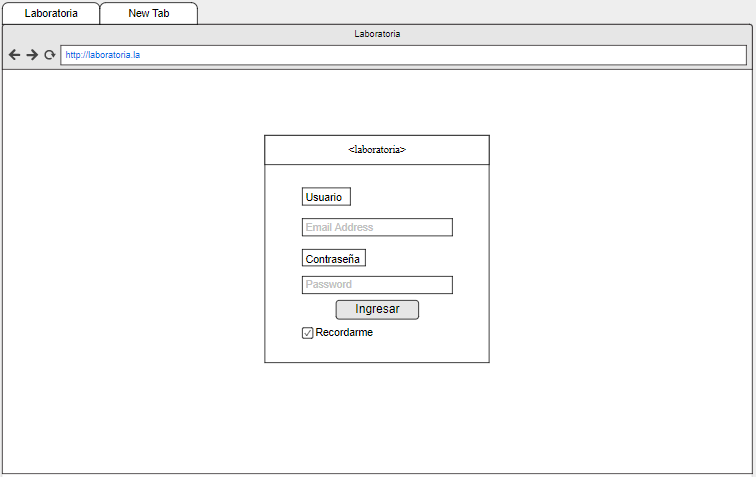
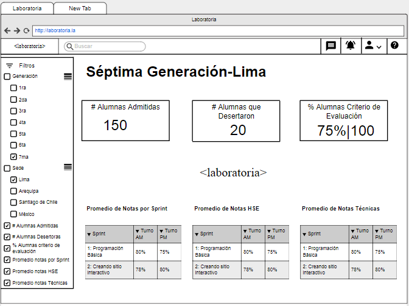

## Data DashBoard

El dashboard es una herramienta utilizada por profesores, training managers, directores y gerentes de Laboratoria para ver rápidamente qué está pasando en el salón de clases de Laboratoria. En el dashboard, los usuarios mencionados pueden ver rápidamente estadísticas y datos en tiempo real como:

* Total de alumnas inscritas
* Total de alumnas que desertaron
* Porcentaje de alumnas que pasan el criterio mínimo de evaluación
* Promedio de notas por sprint
* Promedio de notas HSE
* Promedio de notas técnicas

Además, dado que Laboratoria tiene muchas generaciones, regularmente 2 generaciones por año (estas generaciones empezaron en el 2014), y que opera en 4 sedes (Arequipa, Ciudad de México, Lima y Santiago de Chile), es posible que los usuarios quieran ver datos de sedes / generaciones anteriores para poder hacer comparaciones.

En base a lo mencionado antes, hemos realizado el siguiente prototipo de baja fidelidad.

**Empezamos con un "log in" del usuario**

**Una vez el usuario esté logeado, podrá hacer la búsqueda de la información que desee mediante los filtros.** 

**Se han descrito 6 filtros. Los cuales incluyen el número de generación, la sede, el total de alumnas ingresantes, total de alumnas que desertaron, % de alumanas que pasan criterio de Evaluación, promedio de notas por Sprint, promedio de notas de HSE y promedio de notas Técnicas.**

**Cada filtro a su vez tiene sub filtros, los cuales hacen una búsqueda más personalizada. Elegir el filtro general va a mostrar por default los datos generales de ese filtro**

**El DashBoard propuesto nos muestra los resultados de una búsqueda con 8 filtros**

